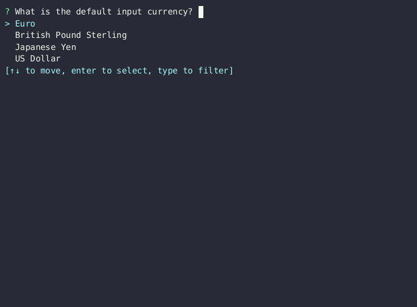

# fbarcalc

This is a quick program that I wrote to help me fill out my annual Foreign
Bank and Financial Accounts (FBAR) report.

Given a starting balance and a list of transactions you can input them and at
the end receive the maximum account balance as well as a conversion to (the
current exchange rate) USD.

- https://www.irs.gov/businesses/small-businesses-self-employed/report-of-foreign-bank-and-financial-accounts-fbar
- https://bsaefiling.fincen.treas.gov/main.html

**N.B.** While you may find this program useful I wrote it for my own personal
use. I am not an accountant and am not liable for any outcome resulting from
your usage of the program. You should be using your own, licensed CPA.

## usage

You can build it if you have the rust toolchain installed:

```shell
cargo build --release
```

Then you can run the configuration where you will select the default input
currency (which will be confirmed on each run) and an API key from
[freecurrencyapi.com](https://freecurrencyapi.com) and is used to convert the
input currency to USD at the end of the process. At the time of writing the
free tier is 5000 requests per month which should be more than enough for the
personal usage once per year.

```shell
fbarcalc config
```

Once configured you can launch the program to run a calculation.

```shell
fbarcalc
```



## development

To regenerate the [asciinema](https://asciinema.org):

```shell
asciinema rec fbarcalc.cast -c \
  "bash -c 'fbarcalc config && echo && fbarcalc'" -t fbarcalc
agg fbarcalc.cast fbarcalc.gif
```

## license

Licensed under the GNU GPL version 3.0 or later.

```
fbarcalc: find account maxium value
Copyright 2024 Mario Finelli

This program is free software: you can redistribute it and/or modify
it under the terms of the GNU General Public License as published by
the Free Software Foundation, either version 3 of the License, or
(at your option) any later version.

This program is distributed in the hope that it will be useful,
but WITHOUT ANY WARRANTY; without even the implied warranty of
MERCHANTABILITY or FITNESS FOR A PARTICULAR PURPOSE.  See the
GNU General Public License for more details.

You should have received a copy of the GNU General Public License
along with this program.  If not, see <https://www.gnu.org/licenses/>.
```
